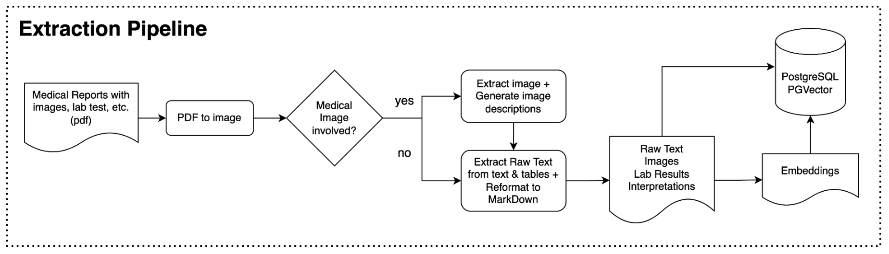

# Medical-Report-Copilot
Leveraging on vision-language LLM to help users to understand about their medical report, advice on lifestyle changes , etc

## Project Motivation
1. Many seniors struggle to understand their medical reports due to complex terminology. As a result, they often turn to Google, ChatGPT, or their children for help—frequently receiving inconsistent or unclear information. This confusion can lead to skepticism toward doctors' diagnoses and treatment plans.

This project aims to build a GenAI-powered chatbot that helps seniors interpret their medical reports in clear, simple language. By offering trustworthy, conversational explanations, the tool empowers them to better understand their health and make informed decisions with greater confidence.

2. Also using this as a playground to test various extraction techniques and tools

## Proposed Solution Architecture
<figure>
    
    <figcaption>This app takes in pdf of medical reports including medical images, checks if it is an image problem or merely a text problem. If it is an image problem, it'll convert pdf to one image per page, employs a multimodal LLM to 'read' the contents and provide interpretations and recommendations. If it is a mere text problem, it'll use a PDF parser to parse out text before using LLM to provide interpretations and recommendations</figcaption>
</figure>

## Features
1. Deployed MedGemma 4b (multimodal) via Google VertexAI vLLM. More about [MedGemma](https://deepmind.google/models/gemma/medgemma/)
2. Configurable between MedGemma, OpenAI, AzureOpenAI
3. Stores text, images, interpretations in database, convert to embeddings for future retrieval upon request
4. Abstracted interpretation as "Memory" (To develop)

## Tech Stack
* Agentic framework: Pydantic AI. (Previously using LiteLLM but find Pydantic AI simplier and more flexible)
* LLM Model: AzureOpenAI, OpenAI, MedGemma
* Database and vector database: PostgreSQL, PGVector
* Observility for agentic calls: TraceLoop

## Documenting progress and findings
* 16June2025: testing pipleine using the eye medical report. It seems to be scanned pdf, which pdfplumber isn't able to handle. Need to use OCR or LLM's imageURL instead.
* 17June2025: Only managed to test Tesseract (OCR). MinerU and Docling couldn't work. Might be due to my local machine. 
* 18June2025: 
    * Realized that this project might not need multi-layer memory. Decide to fall back to PSQL for simpler memory storage.
    * Came across [NanonetsOCR](https://huggingface.co/nanonets/Nanonets-OCR-s) which uses Qwen2.5-VL-3B. Tested it out on hugging face and works well with my existing data. Might consider replacing tesseract with this. To further test it for latency. 
    * When parsing the whole pdf as image to LLM, it tends to 'read' the text part of the pdf even through it was instructed to only analyze the medical image. Thus I created an additional step to extract out the medical image before analysing/interpreting it. Proven effective. 

## Reference & Thoughts
* [AI to help doctors predict disease risk in next phase of Healthier SG 16June2025](https://www.straitstimes.com/singapore/health/ai-to-help-doctors-predict-disease-risk-in-next-bound-of-healthier-sg-ong-ye-kung)
    * Singapore just announced to leverage on health records for predictive AI. Glad that I had something similar in mind when first started this project. 
    * Data may include: National health records, socio-economic, genetic data 
* Planning to include a multi-level memory module, with reference to [Mem0](https://github.com/mem0ai/mem0)