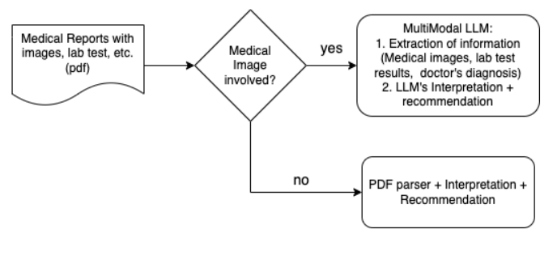

# Medical-Report-Copilot
Leveraging on vision-language LLM to help users to understand about their medical report, advice on lifestyle changes , etc

## Project Motivation
Many seniors struggle to understand their medical reports due to complex terminology. As a result, they often turn to Google, ChatGPT, or their children for help—frequently receiving inconsistent or unclear information. This confusion can lead to skepticism toward doctors' diagnoses and treatment plans.

This project aims to build a GenAI-powered chatbot that helps seniors interpret their medical reports in clear, simple language. By offering trustworthy, conversational explanations, the tool empowers them to better understand their health and make informed decisions with greater confidence.

## Proposed Solution Architecture
<figure>
    
    <figcaption>This app takes in pdf of medical reports including medical images, checks if it is an image problem or merely a text problem. If it is an image problem, it'll convert pdf to one image per page, employs a multimodal LLM to 'read' the contents and provide interpretations and recommendations. If it is a mere text problem, it'll use a PDF parser to parse out text before using LLM to provide interpretations and recommendations</figcaption>
</figure>

## Tech Stack
* Agentic framework: LiteLLM, Instructor
* LLM Model: AzureOpenAI, OpenAI, MedGemma

